# T3 Tape Architecture Blueprint

Audience: engineering leadership, platform architecture, developer productivity, security, and investment review teams.

Status: aligned to the shipped repository state verified on 2026-04-09.

## 1. Executive Summary

T3 Tape is a local-first PatchMD control plane for long-lived software forks.

Its purpose is narrow and high value:

- teams patch upstream software to fit a real product or workflow
- upstream changes later invalidate those patches
- raw diffs alone are not enough to safely reconstruct the customization

T3 Tape solves that by turning each customization into a durable contract with three properties:

1. executable patch state
2. human-readable intent and behavior assertions
3. machine-operational metadata for validation, migration, approval, and audit

The result is a system that does not treat updates as blind merges. It treats them as managed migration cycles with explicit triage, sandbox isolation, agent-assisted resolution, and an approval boundary.

This architecture works because it keeps ownership strict:

- Rust owns protocol behavior and state mutation
- Node owns only distribution and process forwarding
- external agents help, but they do not own history or state rewrites
- `.t3/patch.md` plus `.t3/patch/**` are the only PatchMD-owned surfaces inside Theo's shared `.t3/` namespace

## 2. Problem and Thesis

### The problem

Conventional patch flows break down when upstream code moves:

- `patch-package` or manual forks preserve line changes
- they do not preserve the reason for the customization in an enforceable, machine-readable way
- when upstream refactors the touched surface, teams rebuild the patch from memory

That creates operational drag, review risk, and long-term maintenance cost.

### The thesis

If a forked customization is worth shipping, it is worth recording in two layers:

- code delta
- intent contract

Once both exist, future updates become a controlled re-application process rather than a best-effort merge.

## 3. System Intent

T3 Tape is designed to be:

- local-first
- automation-friendly
- reviewable
- agent-compatible
- auditable

It is not designed to be:

- a hosted agent backend
- a GUI-first product
- a replacement for upstream contribution
- a second patch system living beside git

## 4. Architecture Principles

### 4.1 Single plugin boundary

All protocol-owned state lives behind one root registry plus one plugin subtree:

```text
.t3/patch.md
.t3/patch/
```

There is no shadow database, no alternate registry, and no duplicate state model in the npm layer. Foreign `.t3/*` siblings remain outside PatchMD ownership.

### 4.2 Two-layer atomicity

Every customization is valid only when these exist together:

- `.t3/patch/patches/PATCH-###.diff`
- `.t3/patch.md`
- `.t3/patch/patches/PATCH-###.meta.json`

### 4.3 Sandbox isolation

Migration work happens in `.t3/patch/sandbox/<timestamp>/worktree`, not on the operator's current branch.

### 4.4 External intelligence, internal authority

Agents may:

- resolve conflicts
- re-derive missing surfaces
- suggest intent

Agents may not:

- become the source of truth
- rewrite PatchMD state directly
- bypass approval semantics

### 4.5 Machine-readable review surfaces

`triage.json`, `migration.log`, diff artifacts, and stable exit codes are first-class integration surfaces for CI, bots, dashboards, and control planes.

## 5. System Context

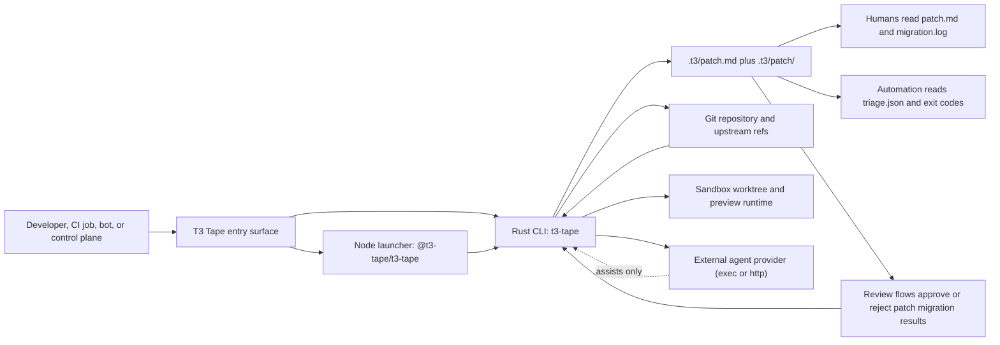

## 6. Top-Level Ownership Model

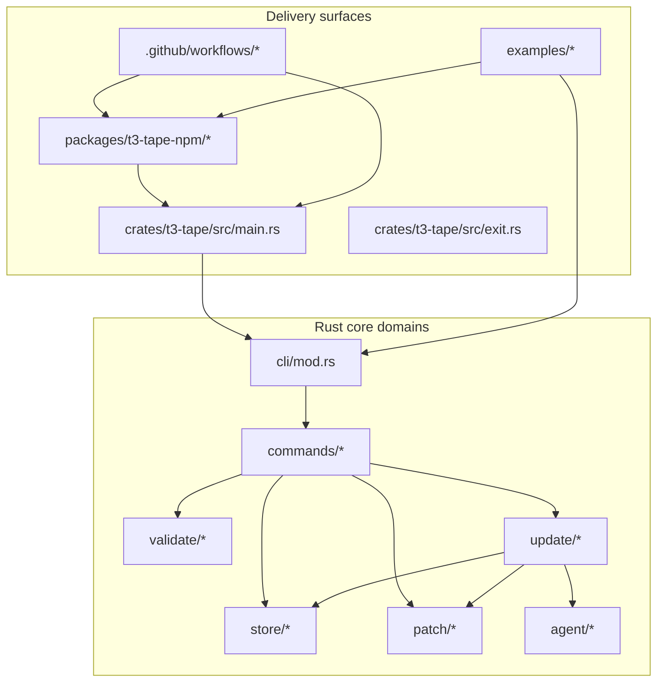

### Ownership by layer

| Layer | Owns | Does not own |
| --- | --- | --- |
| Rust CLI | protocol behavior, state mutation, validation, migration orchestration, approval | binary packaging, SaaS hosting |
| Node launcher | binary resolution and process forwarding | PatchMD parsing, validation logic, migration logic |
| External agent | conflict-resolution and re-derivation output | protocol authority, patch history, approval |
| CI and automation | orchestration and policy decisions | direct mutation of `.t3` internals |

## 7. Canonical Data Model

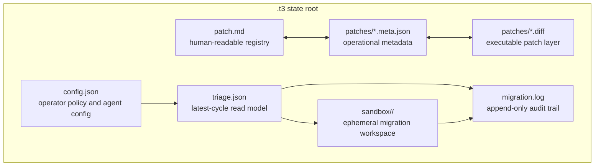

### Why this model works

- `patch.md` preserves intent and behavior contract
- diff files preserve executable code change
- metadata preserves operational state across migrations
- `triage.json` gives automation a stable read model
- `migration.log` gives operators an append-only audit surface
- sandbox artifacts preserve review context without mutating live state prematurely

## 8. Command and Runtime Pipeline

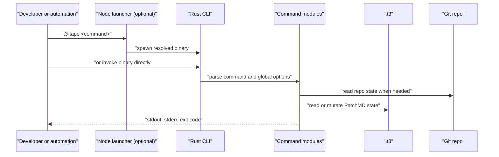

## 9. Patch Recording Pipeline

This is the write-time path for creating durable customizations.

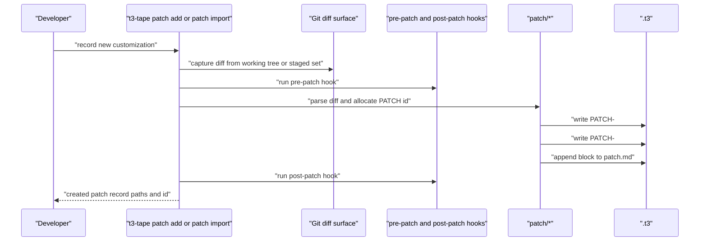

### Why this works

- a patch cannot exist as a raw diff only
- hook execution is explicit and bounded
- creation is atomic enough to avoid partial state on failure
- future migration has the intent, assertions, scope, and metadata required to re-derive behavior

## 10. Validation Pipeline

Validation is the enforcement layer that keeps the protocol honest.

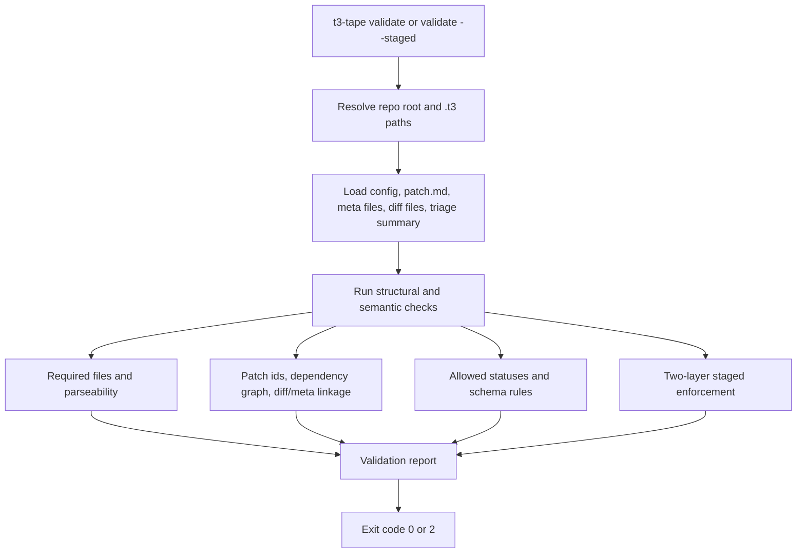

### Validation responsibilities

- reject invalid statuses
- reject missing diff or meta files
- reject dependency cycles
- tolerate foreign `.t3/reports/`
- tolerate missing or placeholder `triage.json` before the first real migration cycle
- enforce staged two-layer writes at commit time

## 11. Update and Migration Pipeline

The update path is the center of the architecture.

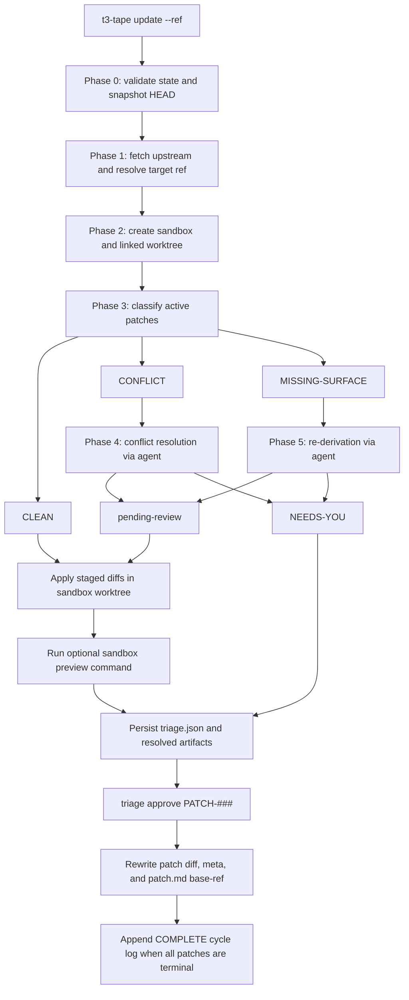

### Classification semantics

| Classification | Meaning | Next action |
| --- | --- | --- |
| `CLEAN` | diff applies cleanly in sandbox | stage and preview |
| `CONFLICT` | surface exists but patch does not apply cleanly | try conflict resolution |
| `MISSING-SURFACE` | original path or surface no longer exists | try intent-first re-derivation |
| `pending-review` | agent output passed confidence threshold | stage for preview and approval |
| `NEEDS-YOU` | agent unavailable, failed, or below threshold | operator review required |

### Why this works

- the current branch stays untouched
- every non-clean path produces persisted artifacts
- agent output is inspectable before approval
- preview can block approval without deleting evidence
- update cycles remain automatable because the read model is explicit

## 12. Agent Interaction Model

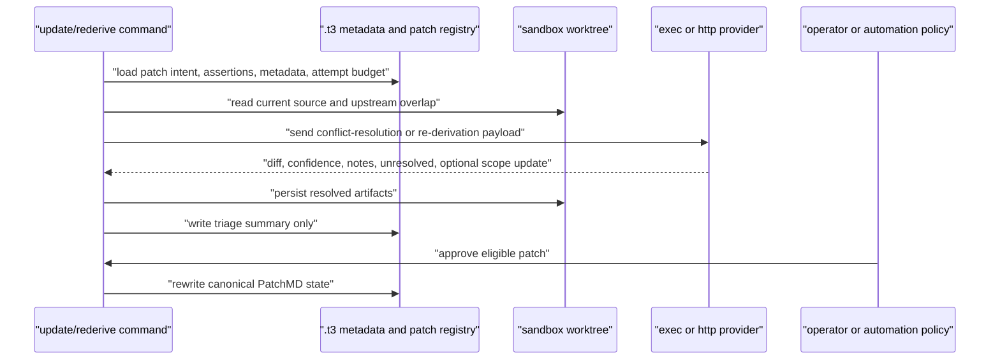

### Why the agent boundary is strong

- provider types are narrow: `none`, `exec`, `http`
- payloads are typed and versioned
- secrets stay in environment variables, not in `.t3`
- confidence thresholds gate automatic progression to `pending-review`
- the agent never writes canonical state directly

## 13. Approval Boundary

Approval is intentionally separate from migration execution.

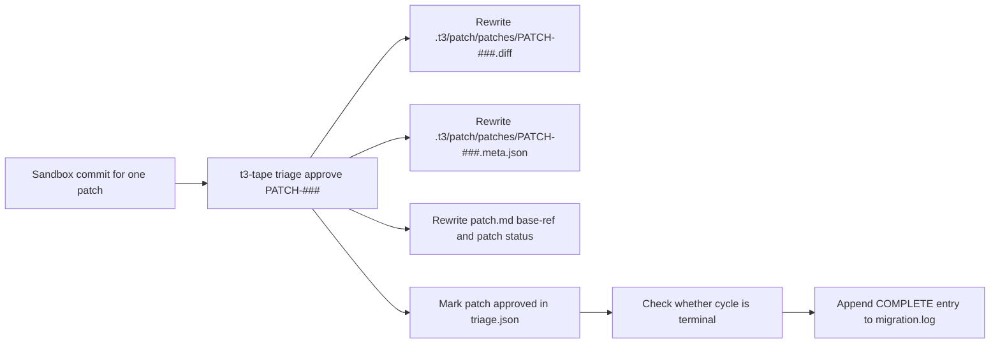

### Why this matters

- review can happen after triage, not during low-level apply attempts
- approval is the only state rewrite boundary after migration
- current branch merge strategy stays under the operator's existing git workflow

## 14. Automation and Service Pipeline

T3 Tape is not a hosted service today. It is a local control plane that exposes stable machine surfaces for external automation.

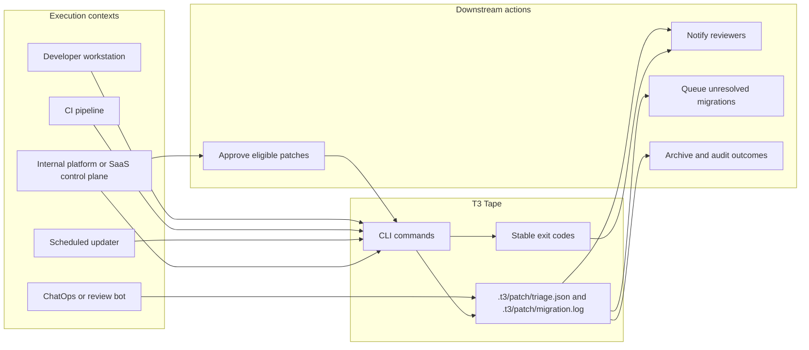

### Integration contract

External systems should:

- run `t3-tape` commands
- read `.t3/patch/triage.json`
- read `.t3/patch/migration.log`
- inspect sandbox artifacts when needed
- route based on exit codes `0` through `5`

External systems should not:

- mutate `.t3/patch.md` directly
- rewrite diff files directly
- invent a competing source of truth

## 15. Distribution Pipeline

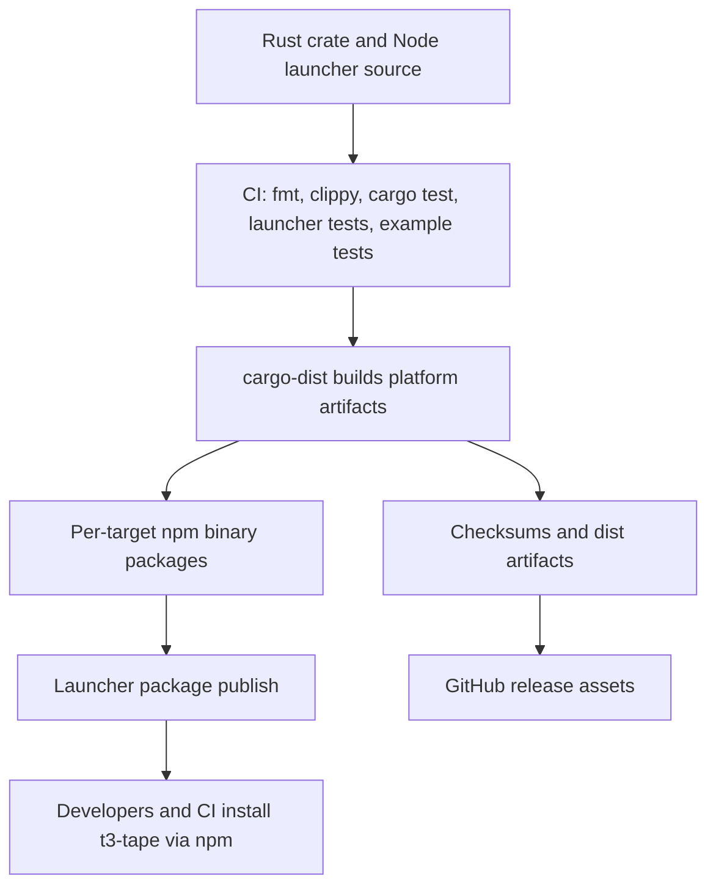

### Why distribution is reliable

- the launcher never downloads binaries at runtime
- packaged platform binaries are published as optional dependencies
- `T3_TAPE_BINARY_PATH` supports local and CI overrides without changing launcher code
- Node remains a thin wrapper around the real Rust binary

## 16. Example Integration Layer

The repo ships an example-side adapter under `examples/agent-kit/`.

Its role is intentionally small:

- read real `.t3` state
- normalize it for JavaScript workflows
- build follow-up `t3-tape` commands

It proves how bots, dashboards, and agentic tools should integrate:

- consume state
- invoke commands
- do not mutate internals directly

## 17. Why the Architecture Works

### 17.1 It preserves intent, not only line offsets

This is the core differentiator. The system remains useful when upstream changes invalidate the original hunk surface.

### 17.2 It isolates risk

Sandbox worktrees keep update experimentation away from the operator's live branch.

### 17.3 It gives both humans and machines first-class surfaces

Humans get:

- `patch.md`
- reviewable diff artifacts
- append-only migration history

Machines get:

- `triage.json`
- predictable commands
- deterministic exit codes

### 17.4 It avoids vendor lock-in

The agent contract is typed and external. Teams can swap providers or run fully private infrastructure.

### 17.5 It scales from one fork to many

The same protocol supports:

- one critical internal fork
- many patched dependencies across a platform fleet
- local operator review
- CI-only drift detection
- centralized control-plane orchestration

## 18. Primary Use Cases

### Long-lived product forks

When a team depends on upstream software but must preserve product-specific behavior.

### Enterprise vendor adaptation

When internal teams need durable customizations on top of vendor or open source components.

### Platform-managed patch fleets

When many repos carry upstream patches and updates must be scheduled, triaged, and audited centrally.

### Agent-assisted maintenance

When teams want automation to resolve straightforward patch drift without surrendering approval control.

### Regulated change management

When teams need an auditable explanation for what was changed, why it exists, and how migration decisions were made.

## 19. Risk Controls and Security Posture

### Built-in controls

- append-only `migration.log`
- explicit approval boundary
- no embedded hosted agent dependency
- environment-based auth token handling
- sandbox isolation
- staged write enforcement
- confidence-gated agent progression

### Important security rules

- treat agent endpoints as code-processing infrastructure
- do not store credentials in `.t3/patch/config.json`
- keep sandbox environments away from production data
- treat diff artifacts as source code, not metadata

## 20. Non-Goals

This architecture deliberately does not attempt to solve:

- full source control hosting
- multi-tenant cloud execution
- automatic merges to protected branches
- GUI-based patch authoring as a prerequisite
- arbitrary SaaS state ownership over PatchMD

## 21. Current Shipped Scope

What is shipped now:

- `init`
- `patch add|list|show|import`
- `hooks print|install`
- `validate`
- `update`
- `triage`
- `triage approve`
- `rederive`
- `export`
- npm launcher
- packaged binary distribution
- CI verification
- runnable example integrations

What is intentionally not shipped now:

- GUI triage interface
- hosted agent backend
- automatic current-branch merge

## 22. Decision Summary

T3 Tape should be understood as a local control plane for intent-preserving software customization.

Its architecture is strong because it makes five decisions and keeps them consistent:

1. one canonical state root
2. one atomic write rule
3. one isolated migration workspace
4. one narrow external agent contract
5. one explicit approval boundary

Those choices turn patch maintenance from an informal craft into an automatable, reviewable, and auditable system.

## 23. Source Map

- [README.md](README.md)
- [docs/patchmd.md](docs/patchmd.md)
- [docs/update-flow.md](docs/update-flow.md)
- [docs/agent-contract.md](docs/agent-contract.md)
- [docs/implementation-status.md](docs/implementation-status.md)
- [crates/t3-tape/src/main.rs](crates/t3-tape/src/main.rs)
- [crates/t3-tape/src/exit.rs](crates/t3-tape/src/exit.rs)
- [crates/t3-tape/src/cli/mod.rs](crates/t3-tape/src/cli/mod.rs)
- [crates/t3-tape/src/patch/mod.rs](crates/t3-tape/src/patch/mod.rs)
- [crates/t3-tape/src/store/mod.rs](crates/t3-tape/src/store/mod.rs)
- [crates/t3-tape/src/validate/mod.rs](crates/t3-tape/src/validate/mod.rs)
- [crates/t3-tape/src/update/mod.rs](crates/t3-tape/src/update/mod.rs)
- [packages/t3-tape-npm/README.md](packages/t3-tape-npm/README.md)
- [packages/t3-tape-npm/src/cli.ts](packages/t3-tape-npm/src/cli.ts)
- [packages/t3-tape-npm/src/resolve.ts](packages/t3-tape-npm/src/resolve.ts)
- [examples/agent-kit/README.md](examples/agent-kit/README.md)
